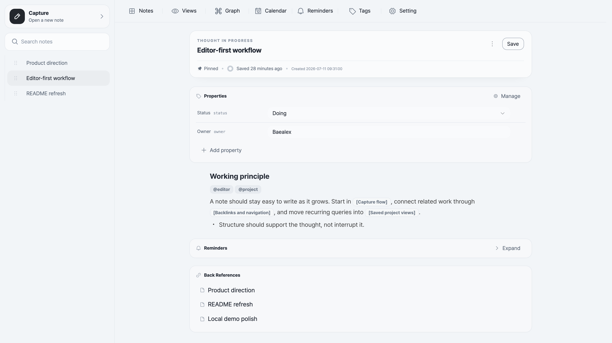

# Ocean Brain

**A self-hosted writing space for connected notes.**

The editor comes first. Capture a note in the browser, connect it to other notes as the thought develops, and keep writing. Incoming references become backlinks automatically. Tags, properties, saved views, and the graph are there when the notes need more structure.

Ocean Brain works well for project decisions, research trails, meeting notes, learning notes, and ideas that are not finished yet.

[Try the live demo](https://demo-ocean-brain.baejino.com/) · [Quick start](#quick-start)

The demo keeps workspace edits in your browser. It does not include server-backed features such as note snapshots or MCP access.



## How notes grow

- **Write first.** Use the block editor and `/` commands without deciding the final structure up front.
- **Connect as you go.** Reference notes by title, follow backlinks, or step out into the graph when a thread gets larger.
- **Add structure when it helps.** Use tags and typed properties, then filter notes into saved list or table views.
- **Find the work again.** Search the workspace, pin active notes, set reminders, or find notes by date in the calendar.

Notes can be copied as Markdown or downloaded as Markdown or HTML. Local image assets can be bundled with an export when the document needs to stand on its own.

## Quick start

These commands enable password mode and bind Ocean Brain to your own machine. Choose a strong password; each example generates a session secret for the current run.

### npx

With Node.js 22 installed:

```bash
OCEAN_BRAIN_PASSWORD='choose-a-strong-password' \
OCEAN_BRAIN_SESSION_SECRET="$(openssl rand -hex 32)" \
HOST=127.0.0.1 \
PORT=6683 \
npx ocean-brain serve
```

Open <http://localhost:6683>. Notes and images persist under `~/.ocean-brain`.

For a stable session secret, storage settings, open mode, and the complete `serve` and `mcp` command reference, see the [npm CLI guide](./packages/cli/README.md).

### Docker

```bash
docker run --rm \
  -e OCEAN_BRAIN_PASSWORD='choose-a-strong-password' \
  -e OCEAN_BRAIN_SESSION_SECRET="$(openssl rand -hex 32)" \
  -p 127.0.0.1:6683:6683 \
  baealex/ocean-brain:latest
```

Open <http://localhost:6683>. This trial is disposable when the container stops.

For a stable session secret, persistent volumes, open mode, exact version tags, and backups, see the [Docker guide](./docs/DOCKER.md).

## Development

Source development uses Node.js `22`, pnpm `10.25.0`, and a `packages/*` workspace. See [DEV_CONVENTION.md](./docs/process/DEV_CONVENTION.md) and [GIT_CONVENTION.md](./docs/process/GIT_CONVENTION.md) before making changes.

## License

Ocean Brain is available under the [MIT License](./LICENSE).
